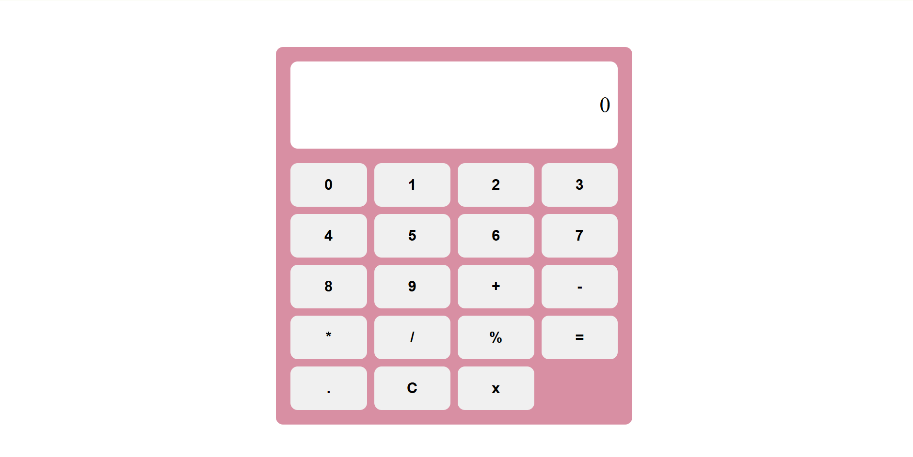

## My Calculator
A simple calculator website built using HTML, CSS, and JavaScript.

## Features
- Addition
- Subtraction
- Multiplication
- Division
- Modulus
- Decimal numbers
- Clear button
- Backspace button
- Keyboard support

## Technologies Used
. HTML
. CSS
. JavaScript

## How to Use
You can use the calculator by clicking the buttons or using your keyboard.

## Live demo
[Veiw my calculator Repositry](https://github.com/Aqsanoor-khan/my-calculator)

 ## My calculator

